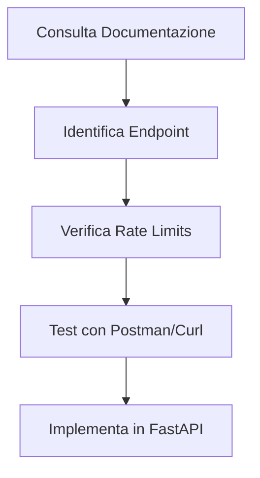
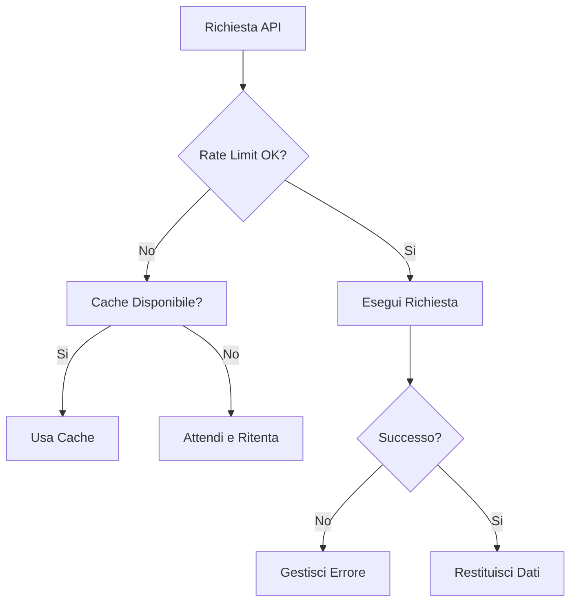
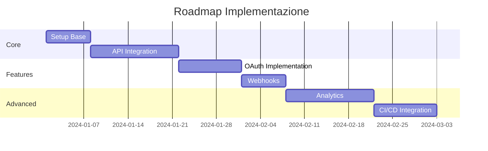

# Esplorare e Integrare API GitHub in FastAPI

## Perché usare le API di GitHub?

GitHub offre una vasta gamma di API RESTful che permettono di:
1. Accedere ai dati dei repository
2. Gestire issues e pull request
3. Automatizzare workflow
4. Integrare funzionalità GitHub in altre applicazioni

## Esplorazione delle API GitHub

### 1. Documentazione e Strumenti
- API Documentation: https://docs.github.com/en/rest
- GitHub API Explorer: https://docs.github.com/en/graphql/overview/explorer



## Implementazione in FastAPI

### Setup Base del Progetto

```python
from fastapi import FastAPI, HTTPException, Depends
from fastapi.security import OAuth2PasswordBearer
from typing import List, Optional
import httpx
import os
from pydantic import BaseModel

# Modelli Pydantic
class Repository(BaseModel):
    name: str
    description: Optional[str]
    stars: int
    language: Optional[str]
    url: str

class Issue(BaseModel):
    title: str
    body: Optional[str]
    state: str
    number: int
    url: str

# Setup FastAPI
app = FastAPI(title="GitHub Integration API")

# Configurazione Client
GITHUB_TOKEN = os.getenv("GITHUB_TOKEN")
GITHUB_API_URL = "https://api.github.com"

# Client asincrono
async def get_github_client():
    async with httpx.AsyncClient(
        base_url=GITHUB_API_URL,
        headers={
            "Authorization": f"token {GITHUB_TOKEN}",
            "Accept": "application/vnd.github.v3+json"
        }
    ) as client:
        yield client

# Endpoints
@app.get("/repos/{owner}/{repo}", response_model=Repository)
async def get_repository(
    owner: str, 
    repo: str, 
    client: httpx.AsyncClient = Depends(get_github_client)
):
    """Ottieni informazioni su un repository specifico"""
    response = await client.get(f"/repos/{owner}/{repo}")
    if response.status_code == 404:
        raise HTTPException(status_code=404, detail="Repository non trovato")
    
    data = response.json()
    return Repository(
        name=data["name"],
        description=data.get("description"),
        stars=data["stargazers_count"],
        language=data.get("language"),
        url=data["html_url"]
    )

@app.get("/repos/{owner}/{repo}/issues", response_model=List[Issue])
async def get_repository_issues(
    owner: str, 
    repo: str, 
    state: str = "open",
    client: httpx.AsyncClient = Depends(get_github_client)
):
    """Ottieni le issues di un repository"""
    response = await client.get(
        f"/repos/{owner}/{repo}/issues",
        params={"state": state}
    )
    if response.status_code != 200:
        raise HTTPException(status_code=response.status_code, detail="Errore nel recupero delle issues")
    
    issues = response.json()
    return [
        Issue(
            title=issue["title"],
            body=issue.get("body"),
            state=issue["state"],
            number=issue["number"],
            url=issue["html_url"]
        )
        for issue in issues
    ]

```

### Aggiunta di Funzionalità Avanzate

```python
# Nuovi modelli
class PullRequest(BaseModel):
    title: str
    state: str
    number: int
    url: str
    mergeable: Optional[bool]

class RepoStats(BaseModel):
    commits_count: int
    issues_count: int
    prs_count: int
    contributors_count: int

# Cache delle richieste
from fastapi_cache import FastAPICache
from fastapi_cache.decorator import cache
from fastapi_cache.backends.redis import RedisBackend
from redis import asyncio as aioredis

# Setup cache
@app.on_event("startup")
async def startup():
    redis = aioredis.from_url("redis://localhost", encoding="utf8")
    FastAPICache.init(RedisBackend(redis), prefix="github-cache")

# Endpoint con cache
@app.get("/repos/{owner}/{repo}/stats", response_model=RepoStats)
@cache(expire=300)  # Cache per 5 minuti
async def get_repository_stats(
    owner: str,
    repo: str,
    client: httpx.AsyncClient = Depends(get_github_client)
):
    """Ottieni statistiche aggregate del repository"""
    async def get_count(endpoint: str) -> int:
        response = await client.get(endpoint)
        return len(response.json()) if response.status_code == 200 else 0

    # Esegui richieste in parallelo
    import asyncio
    commits, issues, prs, contributors = await asyncio.gather(
        get_count(f"/repos/{owner}/{repo}/commits"),
        get_count(f"/repos/{owner}/{repo}/issues"),
        get_count(f"/repos/{owner}/{repo}/pulls"),
        get_count(f"/repos/{owner}/{repo}/contributors")
    )

    return RepoStats(
        commits_count=commits,
        issues_count=issues,
        prs_count=prs,
        contributors_count=contributors
    )

# Webhook handler
from fastapi import Request
import hmac
import hashlib

@app.post("/webhook/{owner}/{repo}")
async def github_webhook(
    owner: str,
    repo: str,
    request: Request,
    x_hub_signature: str = Header(None)
):
    """Gestisci webhook GitHub"""
    body = await request.body()
    
    # Verifica la firma
    if GITHUB_WEBHOOK_SECRET:
        signature = hmac.new(
            GITHUB_WEBHOOK_SECRET.encode(),
            body,
            hashlib.sha1
        ).hexdigest()
        if not hmac.compare_digest(f"sha1={signature}", x_hub_signature):
            raise HTTPException(status_code=400, detail="Invalid signature")

    payload = await request.json()
    event_type = request.headers.get("X-GitHub-Event")

    # Gestisci diversi tipi di eventi
    if event_type == "push":
        # Logica per push event
        pass
    elif event_type == "pull_request":
        # Logica per PR event
        pass
    
    return {"status": "processed", "event": event_type}

# Rate Limiting middleware
from fastapi import Request
from fastapi.middleware.base import BaseHTTPMiddleware
import time

class RateLimitMiddleware(BaseHTTPMiddleware):
    def __init__(self, app, max_requests: int = 30, window_seconds: int = 60):
        super().__init__(app)
        self.max_requests = max_requests
        self.window_seconds = window_seconds
        self.requests = {}

    async def dispatch(self, request: Request, call_next):
        client_ip = request.client.host
        now = time.time()
        
        # Pulisci vecchie richieste
        self.requests = {
            ip: timestamps for ip, timestamps in self.requests.items()
            if timestamps[-1] > now - self.window_seconds
        }
        
        # Verifica rate limit
        if client_ip in self.requests:
            if len(self.requests[client_ip]) >= self.max_requests:
                raise HTTPException(status_code=429, detail="Too many requests")
            self.requests[client_ip].append(now)
        else:
            self.requests[client_ip] = [now]
        
        return await call_next(request)

app.add_middleware(RateLimitMiddleware)

```

## Gestione degli Errori e Best Practices

### 1. Rate Limiting
- Rispetta i limiti di GitHub
- Implementa caching dove possibile
- Usa backoff esponenziale per i retry



### 2. Setup Docker

```yaml
version: '3.8'

services:
  api:
    build: .
    ports:
      - "8000:8000"
    environment:
      - GITHUB_TOKEN=${GITHUB_TOKEN}
      - REDIS_URL=redis://redis:6379
    depends_on:
      - redis
    volumes:
      - ./app:/app

  redis:
    image: redis:alpine
    ports:
      - "6379:6379"
    volumes:
      - redis_data:/data

volumes:
  redis_data:

```

### 3. Monitoraggio e Logging

```python
import logging
from fastapi import Request
from time import time

# Setup logging
logging.basicConfig(
    level=logging.INFO,
    format='%(asctime)s - %(name)s - %(levelname)s - %(message)s'
)
logger = logging.getLogger(__name__)

@app.middleware("http")
async def log_requests(request: Request, call_next):
    start_time = time()
    response = await call_next(request)
    duration = time() - start_time
    
    logger.info(
        f"Path: {request.url.path} "
        f"Duration: {duration:.2f}s "
        f"Status: {response.status_code}"
    )
    
    return response

```

## Estensioni e Miglioramenti Possibili

1. **Autenticazione OAuth**:
   - Implementare flusso OAuth completo
   - Gestire token refresh
   - Supporto multi-utente

2. **Webhooks Avanzati**:
   - Gestione eventi personalizzati
   - Queue asincrona per elaborazione
   - Retry automatico

3. **Funzionalità Aggiuntive**:
   - Analisi del codice
   - Metriche di repository
   - Integrazione con CI/CD



## Conclusione

L'integrazione con GitHub API attraverso FastAPI offre enormi possibilità di automazione e estensione. Punti chiave da ricordare:

1. **Progettazione**:
   - Usa modelli Pydantic
   - Implementa cache dove possibile
   - Gestisci rate limiting

2. **Sicurezza**:
   - Proteggi i token
   - Verifica le firme webhook
   - Implementa rate limiting

3. **Manutenibilità**:
   - Documenta gli endpoint
   - Implementa logging
   - Usa Docker per la distribuzione

4. **Scalabilità**:
   - Usa cache Redis
   - Implementa code asincrone
   - Monitora le performance