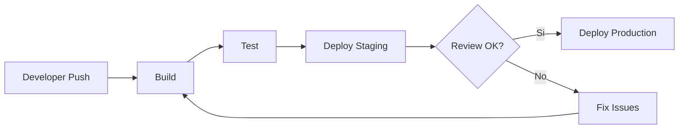
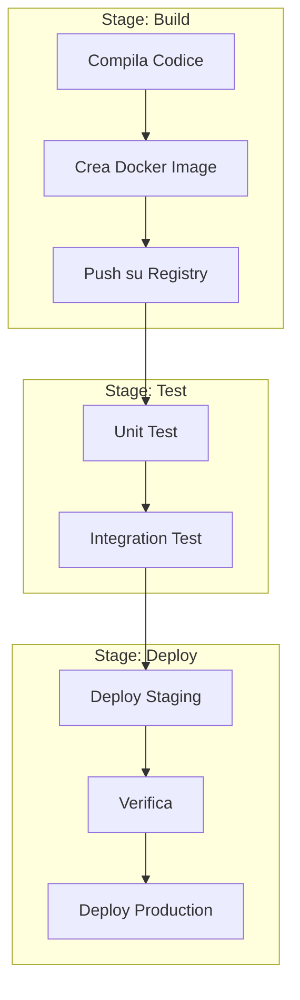
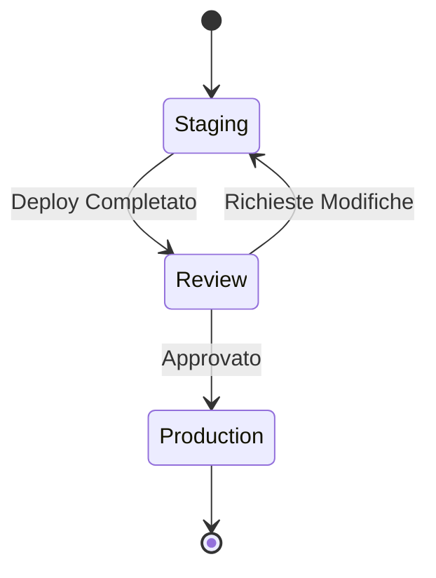

# # Pipeline CI/CD con GitLab: Una Guida Semplificata

## Perché usare una Pipeline CI/CD?

Prima di entrare nei dettagli tecnici, è importante capire perché le pipeline CI/CD sono fondamentali nel sviluppo moderno:

1. **Automazione**: Elimina gli errori umani nel processo di deploy
2. **Velocità**: Riduce i tempi di rilascio del software
3. **Consistenza**: Garantisce che ogni deployment segua gli stessi passi
4. **Qualità**: Verifica automaticamente la qualità del codice prima del rilascio



## Struttura Base di una Pipeline

Una pipeline GitLab è come una catena di montaggio per il tuo codice. Vediamo i componenti principali:



## Implementazione Pratica

### 1. File di Configurazione Base
```yaml
# .gitlab-ci.yml
stages:
  - build
  - test
  - deploy

variables:
  DOCKER_REGISTRY: "gcr.io/mio-progetto"
  APP_NAME: "mia-app"
```

### 2. Stage di Build - Perché e Come

Lo stage di build è il primo passo fondamentale:
```yaml
build:
  stage: build
  script:
    # Creiamo un'immagine Docker che contiene la nostra applicazione
    - docker build -t $DOCKER_REGISTRY/$APP_NAME:$CI_COMMIT_SHA .
    # La pubblichiamo nel registry per usarla negli stage successivi
    - docker push $DOCKER_REGISTRY/$APP_NAME:$CI_COMMIT_SHA
```

**Perché questo stage è importante:**
- Crea un "pacchetto" consistente della nostra applicazione
- Garantisce che l'applicazione possa essere eseguita ovunque
- Versiona l'applicazione con un identificativo unico (SHA del commit)

### 3. Stage di Test - Il Controllo Qualità

```yaml
test:
  stage: test
  script:
    - npm install
    - npm run test
```

**Perché testare nella pipeline:**
- Previene l'introduzione di bug in produzione
- Verifica che le nuove modifiche non rompano funzionalità esistenti
- Documenta il comportamento atteso dell'applicazione

### 4. Stage di Deploy - Dal Test alla Produzione



```yaml
deploy_staging:
  stage: deploy
  script:
    - gcloud run deploy $APP_NAME-staging 
      --image=$DOCKER_REGISTRY/$APP_NAME:$CI_COMMIT_SHA 
      --platform=managed 
      --region=europe-west1
  environment:
    name: staging

deploy_production:
  stage: deploy
  when: manual  # Richiede approvazione manuale
  script:
    - gcloud run deploy $APP_NAME 
      --image=$DOCKER_REGISTRY/$APP_NAME:$CI_COMMIT_SHA 
      --platform=managed 
      --region=europe-west1
  environment:
    name: production
```

**Perché questo approccio:**
1. **Staging First**: Permette di verificare in un ambiente simile alla produzione
2. **Approvazione Manuale**: Aggiunge un livello di controllo umano prima della produzione
3. **Ambienti Separati**: Mantiene isolati i diversi stadi del deployment

## Suggerimenti Pratici

1. **Uso di Docker**:
   - Mantieni le immagini leggere
   - Usa il multi-stage building
   - Versiona sempre le immagini

2. **Gestione degli Ambienti**:
   - Usa variabili d'ambiente per configurazioni diverse
   - Mantieni le credenziali nei secrets di GitLab
   - Documenta le differenze tra gli ambienti

3. **Best Practices**:
   - Testa sempre in staging prima della produzione
   - Mantieni i job della pipeline veloci
   - Usa la cache per velocizzare i build
   - Mantieni un registro dei deployment

## Esempio Pratico di Pipeline Completa

```yaml
stages:
  - build
  - test
  - deploy

variables:
  DOCKER_REGISTRY: "gcr.io/mio-progetto"
  APP_NAME: "mia-app"

# Stage di Build
build:
  stage: build
  script:
    - docker build -t $DOCKER_REGISTRY/$APP_NAME:$CI_COMMIT_SHA .
    - docker push $DOCKER_REGISTRY/$APP_NAME:$CI_COMMIT_SHA

# Stage di Test
test:
  stage: test
  script:
    - npm install
    - npm run test

# Deploy in Staging
deploy_staging:
  stage: deploy
  script:
    - gcloud run deploy $APP_NAME-staging 
      --image=$DOCKER_REGISTRY/$APP_NAME:$CI_COMMIT_SHA
  environment:
    name: staging

# Deploy in Produzione
deploy_production:
  stage: deploy
  when: manual
  script:
    - gcloud run deploy $APP_NAME 
      --image=$DOCKER_REGISTRY/$APP_NAME:$CI_COMMIT_SHA
  environment:
    name: production
  rules:
    - if: $CI_COMMIT_BRANCH == "main"
```

Questa configurazione fornisce un flusso completo per portare il codice dalla fase di sviluppo fino alla produzione.