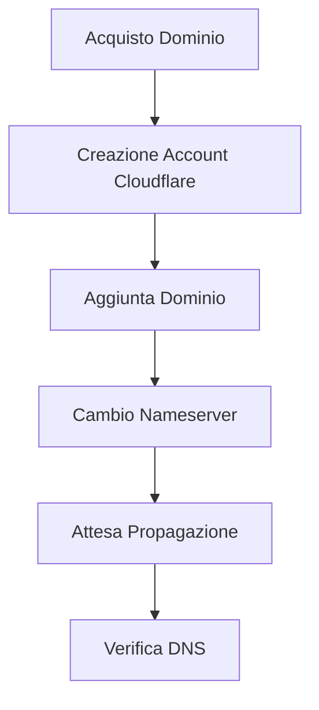
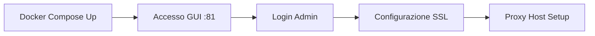
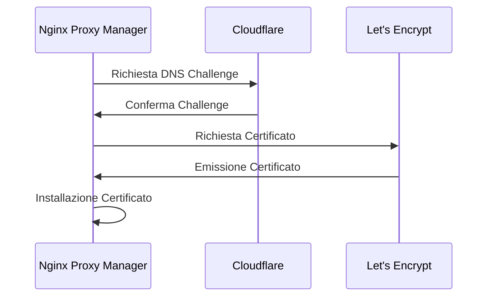
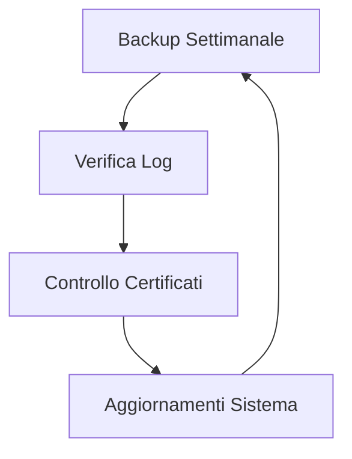

# Guida Completa: Domini, Cloudflare e Proxy Manager

## 1. Acquisto e Gestione del Dominio

### Acquisto del Dominio
1. Scegliere un registrar (esempi popolari):
   - Namecheap
   - GoDaddy
   - Google Domains

### Trasferimento a Cloudflare
1. **Creare un account Cloudflare**
2. **Aggiungere il dominio**:
   - Vai su "Add a Site"
   - Inserisci il dominio
   - Seleziona il piano Free

3. **Cambio DNS**:
   - Cloudflare fornirà due nameserver
   - Accedi al pannello del registrar
   - Sostituisci i nameserver esistenti con quelli di Cloudflare
   - Attendi la propagazione (24-48 ore)



## 2. Token DNS Challenge

### Perché serve un Token DNS Challenge?
Il DNS Challenge è un metodo sicuro per verificare la proprietà del dominio quando si richiedono certificati SSL. È particolarmente utile perché:
- Non richiede porte aperte
- Funziona con sottodomini wildcard
- È più sicuro del challenge HTTP

### Creazione Token su Cloudflare
1. Vai su "My Profile" > "API Tokens"
2. Clicca "Create Token"
3. Usa il template "Edit zone DNS"
4. Configura le permissioni:
   - Zone - DNS - Edit
   - Zone - Zone - Read
5. Limita l'accesso al tuo dominio specifico

## 3. Nginx Proxy Manager con Docker Compose

### Configurazione Docker Compose

```yaml
version: '3'
services:
  npm:
    image: 'jc21/nginx-proxy-manager:latest'
    restart: unless-stopped
    ports:
      - '80:80'      # HTTP
      - '443:443'    # HTTPS
      - '81:81'      # Admin GUI
    volumes:
      - ./data:/data
      - ./letsencrypt:/etc/letsencrypt
    environment:
      DB_MYSQL_HOST: "db"
      DB_MYSQL_PORT: 3306
      DB_MYSQL_USER: "npm"
      DB_MYSQL_PASSWORD: "npm"
      DB_MYSQL_NAME: "npm"

  db:
    image: 'jc21/mariadb-aria:latest'
    restart: unless-stopped
    environment:
      MYSQL_ROOT_PASSWORD: 'npm'
      MYSQL_DATABASE: 'npm'
      MYSQL_USER: 'npm'
      MYSQL_PASSWORD: 'npm'
    volumes:
      - ./mysql:/var/lib/mysql

```

### Avvio del Sistema
1. Crea una directory per il progetto
2. Salva il file docker-compose.yml
3. Esegui:
```bash
docker-compose up -d
```



## 4. Configurazione Certificato SSL

### Accesso all'interfaccia
1. Apri browser: `http://tuoserver:81`
2. Login default:
   - Email: `admin@example.com`
   - Password: `changeme`
   - **Cambia immediatamente le credenziali**

### Configurazione SSL
1. Vai su "SSL Certificates"
2. "Add SSL Certificate"
3. Seleziona "Let's Encrypt"
4. Compila i campi:
   - Domain names (es: tuodominio.com, *.tuodominio.com)
   - Seleziona "Use a DNS Challenge"
   - Provider: Cloudflare
   - Inserisci il token creato precedentemente
5. "Save" e attendi la generazione



## 5. Configurazione Proxy Host

### Creazione Proxy Host
1. Vai su "Proxy Hosts"
2. "Add Proxy Host"
3. Configura:
   - Domain Names: `tuodominio.com`
   - Scheme: `http` o `https`
   - Forward Hostname: `nome-servizio` o `IP`
   - Forward Port: porta del tuo servizio
   - Seleziona il certificato SSL generato
   - Enable SSL Force (consigliato)

### Esempio Pratico

```yaml
# docker-compose.yml
version: '3'
services:
  npm:
    # ... configurazione NPM come sopra ...

  webapp:
    image: 'nginx:alpine'
    restart: unless-stopped
    # Il container è accessibile internamente sulla porta 80
    expose:
      - "80"
    networks:
      - npm_network

networks:
  npm_network:
    driver: bridge

```

### Configurazione Proxy Host per webapp:
- Domain: `webapp.tuodominio.com`
- Scheme: `http`
- Forward Hostname: `webapp`
- Forward Port: `80`

### Best Practices
1. **Sicurezza**:
   - Usa sempre HTTPS
   - Abilita HSTS se possibile
   - Mantieni aggiornati i certificati

2. **Networking**:
   - Usa reti Docker dedicate
   - Esponi solo le porte necessarie
   - Usa nomi di container come hostname

3. **Manutenzione**:
   - Backup regolari dei volumi Docker
   - Monitoraggio dei log
   - Aggiornamenti regolari



## Conclusione

Questa configurazione ti permette di:
1. Gestire in modo sicuro i tuoi domini
2. Automatizzare la gestione dei certificati SSL
3. Creare facilmente proxy inversi per i tuoi servizi
4. Mantenere una struttura organizzata e sicura

Ricorda di:
- Mantenere backup regolari
- Monitorare le scadenze dei certificati
- Aggiornare regolarmente i container
- Documentare le configurazioni